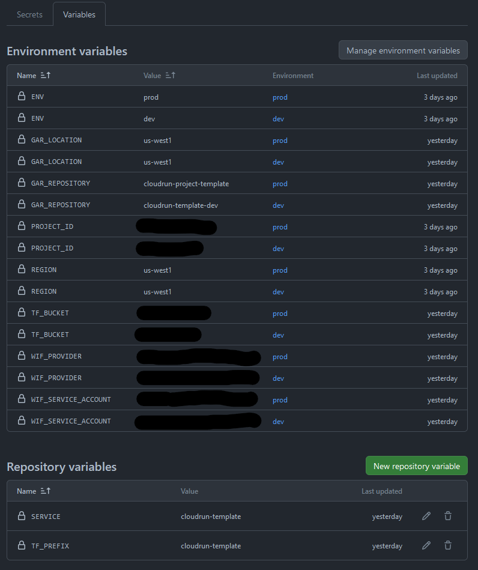

# Project Template for Cloud Run

Repository template for Google Cloud Run services deployed through OpenTofu (Terraform).
 Privilege permissions preconfigured
- IaC through OpenTofu (Terraform)
- CI/CD trhough Github Actions
- Dev and Prod environments
- Resource namespacing based on environment name


## Prerequisites

1. At least one [GCP Project](https://developers.google.com/workspace/guides/create-project) 
	- Recommended: 2 Projects, one for Dev and another for Prod
2. Enable the following APIs on for you project(s): IAM, Resource Manager, Cloud Run and Secret Manager 
3. A [Artifact Registry Docker Repository](https://cloud.google.com/artifact-registry/docs/repositories/create-repos#create-gcloud) withing the project
4. A [GCS Bucket](https://cloud.google.com/storage/docs/creating-buckets) for Tofu state management, also withing the project
5. Recommended: [gcloud CLI](https://cloud.google.com/sdk/docs/install) to facilitate project setup

## Configuration

After creating a new repository from this template, follow this steps to configure it.

*Note:* This template and configuration guide *assumes both the GAR Repository and GCS Bucket are deployed within the same project as the application stack*. It is not too modify the `deploy.sh` and the configuration steps to enable these possibilites. However, I prefered to assume all resources inthe same project to simplify the configuration process. 

### 1. Setup Workload Identity Federation for Github Actions

You can read more on this on Google Blog's on [Enabling Keyless Authentication from Github Actions](https://cloud.google.com/blog/products/identity-security/enabling-keyless-authentication-from-github-actions)  

On this step, we're going create a workload identity pool and provider.  

First, create a Wokload Indentity pool
```bash
gcloud iam workload-identity-pools create "ci-cd" \
  --location="global" \
  --display-name="CI/CD"
```

Second, create a provider
```bash
gcloud iam workload-identity-pools providers create-oidc "github-actions" \
  --location="global" \
  --workload-identity-pool="ci-cd" \
  --display-name="Github Actions" \
  --attribute-mapping="google.subject=assertion.sub,attribute.repository=assertion.repository" \
  --issuer-uri="https://token.actions.githubusercontent.com"
```

You can then, print the workload identity pool name with:
```bash
gcloud iam workload-identity-pools describe ci-cd --location global
```

### 2. Prepare a Service Account

First setup a these variables. These are example values. Fill in with your actual values.
```bash
PROJECT_ID=my-project-id
WIF_POOL=projects/123456789/locations/global/workloadIdentityPools/ci-cd
WIF_SERVICE_ACCOUNT_NAME=devops-svc
GAR_REPOSITORY_NAME=my-gar-repo
GAR_LOCATION=us-central1
TF_STATE_BUCKET=my-tf-bucket-12438709
GH_REPO=altxtech/cloudrun-project-template
```

Create a Service Account
```bash
gcloud iam service-accounts create $WIF_SERVICE_ACCOUNT_NAME \
    --description="Devops account for Cloud Run projects" \
    --display-name="Devops Service Account for Cloud Run"
```

Give the Service Account access to manage infrastructure in the GCP project
```bash
gcloud projects add-iam-policy-binding $PROJECT_ID \
    --member="serviceAccount:${WIF_SERVICE_ACCOUNT_NAME}@${PROJECT_ID}.iam.gserviceaccount.com" \
    --role="roles/datastore.owner" \
	--condition=None

gcloud projects add-iam-policy-binding $PROJECT_ID \
    --member="serviceAccount:${WIF_SERVICE_ACCOUNT_NAME}@${PROJECT_ID}.iam.gserviceaccount.com" \
    --role="roles/iam.serviceAccountUser" \
	--condition=None

gcloud projects add-iam-policy-binding $PROJECT_ID \
    --member="serviceAccount:${WIF_SERVICE_ACCOUNT_NAME}@${PROJECT_ID}.iam.gserviceaccount.com" \
    --role="roles/iam.serviceAccountAdmin" \
	--condition=None

gcloud projects add-iam-policy-binding $PROJECT_ID \
    --member="serviceAccount:${WIF_SERVICE_ACCOUNT_NAME}@${PROJECT_ID}.iam.gserviceaccount.com" \
    --role="roles/resourcemanager.projectIamAdmin" \
	--condition=None

gcloud projects add-iam-policy-binding $PROJECT_ID \
    --member="serviceAccount:${WIF_SERVICE_ACCOUNT_NAME}@${PROJECT_ID}.iam.gserviceaccount.com" \
    --role="roles/run.admin" \
	--condition=None
	
gcloud projects add-iam-policy-binding $PROJECT_ID \
    --member="serviceAccount:${WIF_SERVICE_ACCOUNT_NAME}@${PROJECT_ID}.iam.gserviceaccount.com" \
    --role="roles/secretmanager.admin" \
	--condition=None
```

Give the Service Account access to read and write artifacts from the repository:
```bash
gcloud artifacts repositories add-iam-policy-binding $GAR_REPOSITORY_NAME \
    --location=$GAR_LOCATION \
    --member="serviceAccount:${WIF_SERVICE_ACCOUNT_NAME}@${PROJECT_ID}.iam.gserviceaccount.com" \
    --role="roles/artifactregistry.repoAdmin" 
```

Give the Service Account access to manage the TF state in the GCS bucket
```bash
gcloud storage buckets add-iam-policy-binding gs://${TF_STATE_BUCKET} \
        --member="serviceAccount:${WIF_SERVICE_ACCOUNT_NAME}@${PROJECT_ID}.iam.gserviceaccount.com" \
        --role=roles/storage.objectUser
```

Give Github Actions Access to impersonate the service account through Workload Identity Federation
```bash
gcloud iam service-accounts add-iam-policy-binding "${WIF_SERVICE_ACCOUNT_NAME}@${PROJECT_ID}.iam.gserviceaccount.com" \
  --project="${PROJECT_ID}" \
  --role="roles/iam.workloadIdentityUser" \
  --member="principalSet://iam.googleapis.com/${WIF_POOL}/attribute.repository/${GH_REPO}"
```

**Recommended**: Specially if you intend to use one GCP project for each environment, setup two different accounts, one for dev and another for prod, in their respective GCP projects

### 2. Configuring Environment Variables

- **SERVICE**
  - **Name:** `SERVICE`
  - **Description:** Name of the service. Used for naming deployed resources. Recommended to set as a Repository Variable for consistent naming of resources across environments.
  - **Example:** `my-service`

- **ENV**
  - **Name:** `ENV`
  - **Description:** Used for namespacing resources to their specific environment. Also passed as an environment variable to the Cloud Run service.
  - **Example:** `dev`

- **GAR_LOCATION**
  - **Name:** `GAR_LOCATION`
  - **Description:** Specify the Artifact Repository location to read and write images. Recommended to have a separate repository per environment.
  - **Example:** `us-central1`

- **GAR_REPOSITORY**
  - **Name:** `GAR_REPOSITORY`
  - **Description:** Specify the Artifact Repository to read and write images. Recommended to have a separate repository per environment.
  - **Example:** `my-artifact-repo`

- **PROJECT_ID**
  - **Name:** `PROJECT_ID`
  - **Description:** Project where the application stack will be deployed. Recommend using a separate project per environment.
  - **Example:** `my-project-dev`

- **REGION**
  - **Name:** `REGION`
  - **Description:** Region where the application stack will be deployed.
  - **Example:** `us-central1`

- **TF_BUCKET**
  - **Name:** `TF_BUCKET`
  - **Description:** Backend configuration for OpenTofu. At least one of these needs to be environment-specific. Recommended to have separate buckets for each environment.
  - **Example:** `my-tf-bucket-dev-213496087`

- **TF_PREFIX**
  - **Name:** `TF_PREFIX`
  - **Description:** Backend configuration for OpenTofu. If storing state for both environments in a single bucket, specify a different prefix or workspace for each environment.
  - **Example:** `my-service-state`

- **TF_WORKSPACE**
  - **Name:** `TF_WORKSPACE`
  - **Description:** Backend configuration for OpenTofu (Optional). If storing state for both environments in a single bucket, specify a different prefix or workspace for each environment.
  - **Example:** `dev-workspace`

- **WIF_PROVIDER**
  - **Name:** `WIF_PROVIDER`
  - **Description:** Workload Identity Federation configuration. Should be in the format `projects/736537866288/locations/global/workloadIdentityPools/ci-cd/providers/github-actions`.
  - **Example:** `projects/0123456789/locations/global/workloadIdentityPools/ci-cd/providers/github-actions`

- **WIF_SERVICE_ACCOUNT**
  - **Name:** `WIF_SERVICE_ACCOUNT`
  - **Description:** Workload Identity Federation configuration. Recommended to have separate configuration for each environment.
  - **Example:** `devops-svc@my-project-dev.iam.gserviceaccount.com`

Example configuration:  


## Dev and Prod environments

If the Workload Identity Federation and the environment variables are configured correctly, a deployment job will trigger on pushes for the `main` and `dev` branches. Which will respectivelly deploy to the `prod` and `dev` environments.

## Accessing the Secret Manager Secret and Firestore Database from your serviceAccountAdmin

The service will be deployed with the `ENV`, `SECRET_ID` and `DATABASE_ID` environment variables. Use the appropriate Google Cloud client libraries to interact with these resources. 

## Modifying the Secret Value

The secret will be deployed with a default 'secret-data' value. You can modify this value after deploymenth through the GCP console or the gcloud cli. If you instead prefer to set these secret values at deploymeht, you can can modify the deploy.sh file, inthe `Tofu Plan` step, to include a `--var "secret_value=${{ secrets.< your secret name > }}"`, then set said secret as repository or environment secret. 
